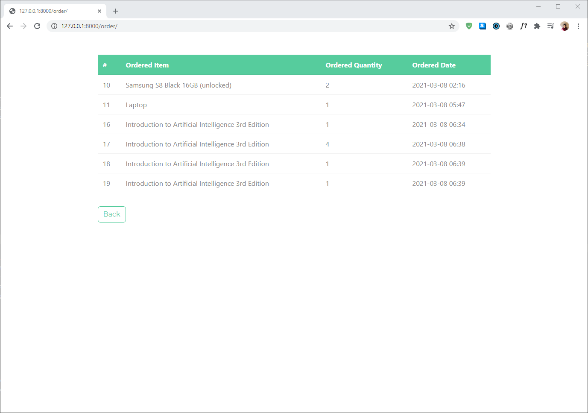

# django-practice-2

## Descriptions

This is a second small Django exercise for myself to practice Django, Bootstrap, jQuery, and a little bit of Django Rest Framework. The code will generate a minimalistic ecommerce shopping website with basic features like registering, sign-in, sign-out, viewing/uploading products, 'purchasing' an item, and keeping track of current stock of each product. The Bootstrap template used here is called [Minty](https://bootswatch.com/minty/) and more temnplates can be found in [Bootswatch](https://bootswatch.com/). I also used [Summernote](https://summernote.org/), which is a text-editing tool users can utilize when writing product descriptions.

## Installation

I installed Django (version 3.1.7) and Django Rest Framework (version 3.12.2)

```bash
pip install django
```

```bash
pip install djangorestframework
```

## Demonstrations

We can go to the registration page to create a new account.


Now we can sign in to the webiste.


This is what the main page looks like when you're logged in.


When we click 'Shop', we get a list of different posts published by 'admin' users, who have permissions to create posts.


Notice that when we hover the cursor over the product name, it displays the item's current stock. Django Rest Framework was used for this function.


We can view and/or purchase a product. Purchasing the product will automatically update the item's stock.


And we can write a post as well (if you get permission from the admin). Using summernote, users have many text-editing options (headings, highlights, images, etc.)


There is also a section in which we can view our transaction history.

